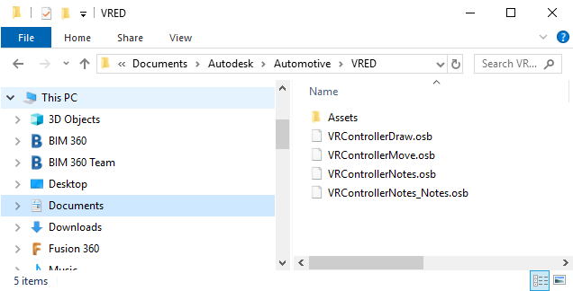

# Python VR functions for VRED
### Improve your VRED VR experience with custom python functions
### Just copy and paste python code to your VRED Scene

 

### Before you start:
To have a customized VR Controller, please copy all the files named VRControllerXXX.osb to your user\Documents\Autodesk\Automotive\VRED folder

 

### VRED-VR-drawLines.py - you can draw in VRED
You can use this script in VR or in Desktop Mode to Sketch on your HighQuality Model in VRED.
The Color of your line will Automatically adapt to your Collaboration color.
Works ootb in Collaboration.

In Desktop Mode: Press D to draw
In VR: Go to your VR Menu and choose Draw. 
Use the Trigger to draw.
Press the middle of the touchpad to change the draw mode.
Press the left of the touchpad to delete the last line.
Press the bototm of the touchpad to hide all lines.

VRED-drawLines:

### VRED-VR-createNotes.py - you can create notes in VRED
You can use this script in VR to create Notes in your Scene. 
Customize the file VRControllerNotes_Notes.osb to change the shape of your Notes. You can add as many Notes as you want below the Switch Node "Notes"

Works ootb in Collaboration.

In VR: Go to your VR Menu and choose Notes.
Use the Trigger to create a note.
Press the middle of the touchpad to change the create mode.
Press the left of the touchpad scale the active note smaller.
Press the right of the touchpad scale the active note bigger.
Press the top of the touchpad to toggle to the next note type.
Press the bottom of the touchpad to active delete mode. Once deleted, you can hover with the ray over any note and press the trigger to delete

VRED-VR-createNotes:

